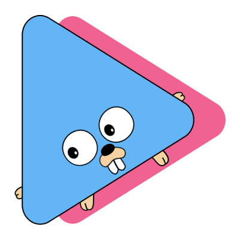

# Holodex-Go (WIP)



Holodex-Go is a Go package that provides a client to use [Holodex](https://holodex.net/) V2 API.

**DISCLAIMER:** This package was made by hobby to learn how to use golang and implement some design patterns. It's probably filled with bugs or lacking features. I might or might not continue updating it.

If you want to contribute to the project or give some recommendations you're totally invited to do so through issues and pull requests.

<br />

## Getting Started

### Installing

Make sure to have a working [Go environment](https://go.dev/doc/install)

```
go get github.com/belseir/holodex-go
```

### Usage

Import the client into your project.

```go
import (
    holodex "github.com/belseir/holodex-go/pkg"
)
```

Get an API key by creating an account on [Holodex](https://holodex.net/)

Create a new Client using your API key.\
**Note:** The HolodexClient uses a singleton pattern, the apiKey and cache will be used through all your clients inside the same project.

```go
client := holodex.NewHolodexClient("<YOUR_API_KEY>")
```

# Documentation

- The Holodex API documentation can be found [here](https://docs.holodex.net/)
- As for the package documentation, it can be found at `/docs/` (WIP)

# Examples

```go
package main

import (
	"fmt"
	"log"

	holodex "github.com/belseir/holodex-go/pkg"
	"github.com/belseir/holodex-go/pkg/builders"
	"github.com/belseir/holodex-go/pkg/enums"
)

func main() {
    client := holodex.NewHolodexClient("<API_KEY>")

    query, err := builders.NewChannelQueryBuilder().
		SetLang(enums.Langs.ENGLISH).
		SetOrg("Hololive").
		SetSort(enums.ChannelSortBy.SUBSCRIBER_COUNT).
		SetOrder(enums.Order.DESC).
		SetLimit(3).
		Build()

    if err != nil {
        log.Fatalln(err)
    }

    channels, err := client.GetChannels(holodex.GetChannelsOptions{
        Query: query,
    })

    if err != nil {
        log.Fatalln(err)
    }

    fmt.Println(channels)
}
```
